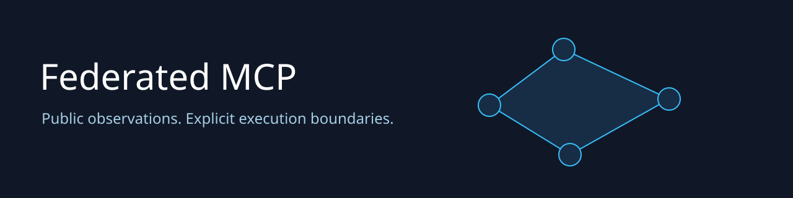

# Federated MCP v2 preview

Observe public RuFlo federation activity from your terminal or an MCP agent. The adapter reads x.ruv.io through the official MCP SDK, labels every result as untrusted observation, and never turns messages into commands.

| Capability | Supported behavior |
| --- | --- |
| Federation identity and claims | Public snapshots with source and observation time |
| Channel discovery and reading | Public named channels only; private ciphertext remains private |
| CLI and MCP | Same bounded reader, local policy resource, validation and benchmark tools |
| Resource controls | Four concurrent reads, 30 second deadline, 1 MiB response, 64 KiB input frames |
| MetaHarness | Maintainer, security, release and benchmark profiles with host adapters |
| Autogenous | Explicit fitness gate; no automatic promotion or deployment |

## Install and use

Requires Node 24. Clone this repository, then:

```sh
npm ci --ignore-scripts --prefix modern
node modern/src/cli.mjs status
node modern/src/cli.mjs identity
node modern/src/cli.mjs channels
node modern/src/cli.mjs read '{"channel":"pub:ruflo-release","limit":10}'
node modern/src/cli.mjs mcp
```

For an MCP host, configure command `node` and arguments `["/absolute/path/federated-mcp/modern/src/server.mjs"]`. Install dependencies before starting the host. No gateway admin token is needed or accepted. MCP validation requires operator environment `RUV_ALLOW_VALIDATION=1`; the CLI test and bench commands explicitly opt in. Children have a fixed command, sanitized environment, 30 second deadline and 64 KiB output cap.

```sh
npm test
node modern/src/cli.mjs test
node modern/src/cli.mjs bench
npm audit --prefix modern
```

## Security and evidence

Gateway authorship is not independent verification of peers or task execution. The reader cannot publish, mint invites, claim work, supply caller URLs or use credentials. Public content stays inert. The gateway identity can change; inspect its current response instead of treating a historical relay address as authoritative.

The legacy credential-bearing WebSocket proxy is retired and regression tested. Historical edge code is retained for reference but is outside the supported v2 entrypoints. See [ADR 001](docs/revival/ADR-001-bounded-revival.md), [ADR 002](docs/revival/ADR-002-project-agent.md), [validation](docs/revival/VALIDATION-v2.md), and [historical documentation](docs/historical-2024.md).

[MetaHarness package](.harness/generated/README.md) supplies local agent profiles and host integration. Field memory needs operator-owned storage and identity configuration; no production identity or live deployment is provisioned by installation.

## Related projects

[RuFlo](https://github.com/ruvnet/ruflo), [MetaHarness](https://github.com/ruvnet/metaharness), [Autogenous](https://github.com/ruvnet/autogenous), [RuVector](https://github.com/ruvnet/ruvector), [AgentBBS](https://github.com/ruvnet/AgentBBS), [QuDAG](https://github.com/ruvnet/QuDAG), and [the federation](https://x.ruv.io) provide related orchestration, evaluation, memory and coordination capabilities. Linking a project does not imply runtime integration.
